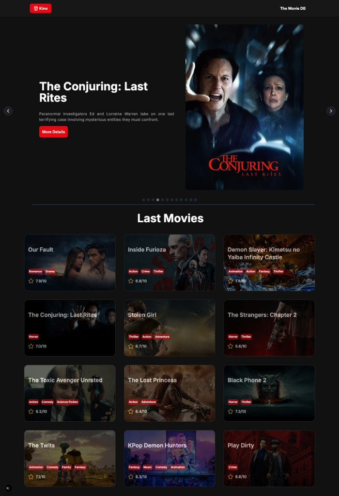
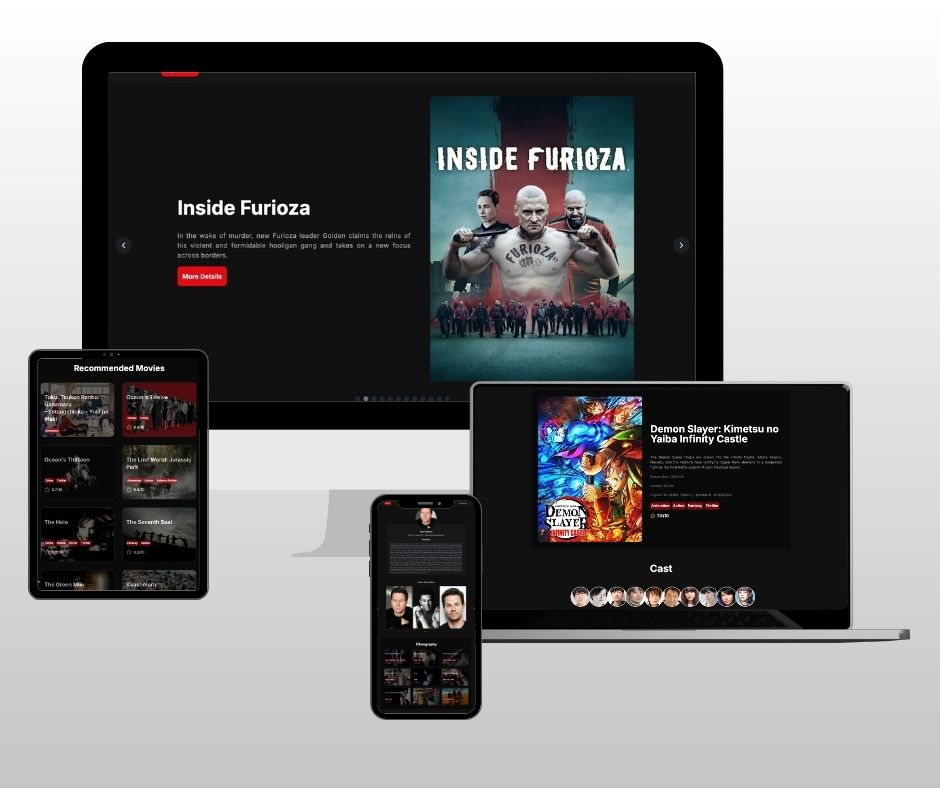

# Kino: The Movie Discovery Platform


<p align="center">
  
</p>

## 🤔 About The Project

**Kino** is a modern movie discovery platform built to showcase my commitment to mastering the **Next.js** framework and advanced front-end development patterns. This project serves as a key piece in my portfolio as I transition into a dedicated front-end role.

The application allows users to view and navigate the latest film releases by leveraging a public API endpoint, providing a clean, responsive, and intuitive user experience.

My primary goal with Kino was to move beyond foundational concepts and directly apply industry-standard technologies, focusing on:

* Implementing **Server-Side Rendering (SSR)** and **Client-Side Components** in Next.js for optimized performance and SEO.
* Enforcing code quality and structure through **TypeScript**.
* Creating a fully **responsive and modern UI** using the utility-first approach of **Tailwind CSS**.

This project demonstrates my ability to rapidly integrate new, complex technologies and deliver a robust, functional, and visually appealing application.


<p align="center">
  
</p>

## ✨ Key Features

* **Latest Releases Catalog:** Displays a curated list of the most recent movies.
* **Detailed Production View:** Provides complete information for each film, including **technical specifications** (year, duration, rating).
* **Rich Cast Gallery:** Showcases the main actors, their roles, mini-biographies, and principal works.
* **Intelligent Recommendations:** Suggests related films based on genres and actors' participation.
* **Modern & Responsive Design:** A sleek interface built with Tailwind CSS that adapts seamlessly to all screen sizes.

## ⚙️ Tech Stack

| Technology | Purpose | 
| :--- | :--- | 
| **Next.js** | React Framework for server-side rendering and routing. | 
| **TypeScript** | Type safety and improved developer experience. | 
| **Tailwind CSS** | Utility-first CSS framework for rapid and responsive styling. | 
| **React** | Core component library. | 
| **TheMovieDB API** | External data source for movie information. | 

## 🖥️ Installation

To get a local copy up and running, follow these simple steps.

### Prerequisites

You need **Node.js** installed on your machine.

### Execution

1.  **Clone the repository:**
    ```bash
    git clone [https://github.com/ferdsleite/kino-movie-api-project](https://github.com/ferdsleite/kino-movie-api-project)
    ```
2.  **Navigate to the project directory:**
    ```bash
    cd kino
    ```
3.  **Install NPM dependencies:**
    ```bash
    npm install
    ```
4.  **Configure Environment Variables:**
    Create a file named `.env` in the root of the application. It must contain the necessary API key and environment variables listed in the provided `.env.example` file.
    
    *Example `.env` content (variables will vary based on TheMovieDB requirements):*
    ```
    NEXT_PUBLIC_API_KEY="YOUR_TMDB_API_KEY"
    NEXT_PUBLIC_API_URL="[https://api.themoviedb.org/3](https://api.themoviedb.org/3)"
    NEXT_PUBLIC_BG_MOVIE_URL="[https://image.tmdb.org](https://image.tmdb.org)"
    ```
5.  **Start the Next.js development server:**
    ```bash
    npm run dev
    ```
6.  **Access the project:**
    Open your browser and navigate to `http://localhost:3000`.

## 🕹️ Usage

Once the application is running, you can:

1.  View the main page to see the **latest movie releases**.
2.  Click on any movie card to view its **detailed page**, including the technical fiche, cast, and related recommendations.
3.  The application is fully **responsive** and can be tested on different screen sizes to see the Tailwind CSS implementation in action.

## ⭐ Main dependencies
- [Lucide React](https://lucide.dev/guide/packages/lucide-react)
- [CSLX](https://www.npmjs.com/package/clsx )
- [Framer Motion](https://motion.dev/docs/react)
- [Tailwind Merge](https://github.com/dcastil/tailwind-merge/blob/v3.3.1/docs/what-is-it-for.md)

## 💎 Helpful links
- [The Movie DB](https://developer.themoviedb.org/docs/getting-started)
- [Next.js](https://nextjs.org/docs)

## 👩‍💻 Connect with me

[](https://www.linkedin.com/in/fernandaleitedepaula)

Project Link: [https://github.com/ferdsleite/kino-movie-api-project](https://github.com/ferdsleite/kino-movie-api-project)

---
<p align="center">Built by Fernanda Leite with 💙 and Next.js, showcasing a transition to modern web development.</p>